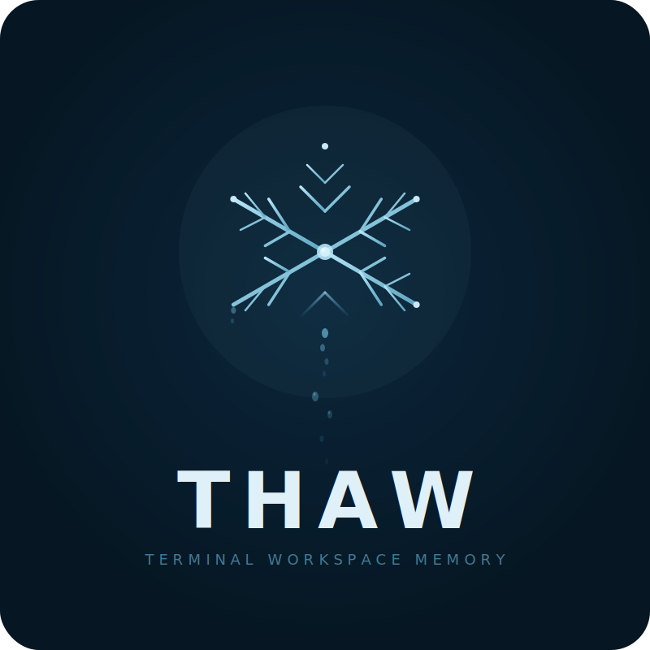

<p align="center">
  
</p>

<h1 align="center">thaw</h1>

<p align="center"><strong>Close your laptop. Open it tomorrow. Everything's back.</strong></p>

Thaw captures your terminal workspace — every session, process, git branch, command history, and environment variable — and restores it exactly as it was.

> Built by [JOECAT](https://github.com/joecattt) · Maintained by [Dreams Over Dollars Foundation](https://dreamsoverdollars.org) 501(c)(3)

---

## What it does

You're working across 12 terminal sessions. Two projects. Postgres running, dev server on port 3000, halfway through debugging a failing test. You close your laptop.

Tomorrow morning, you run `thaw`:

```
Last snapshot: 14h ago (Mon 5:12 PM)

  Projects to restore:
  1) Popupplaza [main*] — 8 sessions (6 active, 2 idle)
  2) api-project [feature/auth*] — 4 sessions ⚠ deps may be stale
     ↳ 3 new upstream commits — pull needed

  a) Restore all    q) Quit

  Choice:
```

Type `1`. Thaw rebuilds your tmux workspace — every pane, directory, env var, git branch. Dev server starts. You're back in 10 seconds.

## Install

```bash
# From source
git clone https://github.com/joecattt/thaw.git && cd thaw
make install
thaw setup
```

`thaw setup` configures shell hooks, the background daemon, and runs a health check. One command.

## Commands

| Command | What it does |
|---------|-------------|
| `thaw` | Interactive restore picker |
| `thaw freeze` | Snapshot current state |
| `thaw save <name>` | Save named workspace |
| `thaw recall <name>` | Restore named workspace |
| `thaw recap` | AI work summary (text/voice/visual) |
| `thaw progress` | Project health dashboard |
| `thaw context` | Last session state for a directory |
| `thaw export` | CSV/JSON data export |
| `thaw dashboard` | HTML analytics report |
| `thaw init` | Generate .thaw.toml for current project |
| `thaw diff` | Changes since last snapshot |
| `thaw status` | Active sessions |
| `thaw doctor` | Installation diagnostics |

Admin: `thaw admin note|forget|tag|audit|export|import|prune|migrate|uninstall`

## Project config

```toml
# .thaw.toml in any project root
[project]
name = "my-app"
restore_commands = ["npm run dev", "docker compose up -d"]
env = { NODE_ENV = "development" }
test_command = "npm test"
health_check = "curl -s localhost:3000/api/health"
```

Generate automatically: `thaw init`

## Features

- **Interactive restore** — pick which projects to bring back
- **Idle gap detection** — 30min+ gap triggers automatic context display
- **Autostash** — auto `git stash` when switching projects
- **Upstream awareness** — new commits, CI failures, dep changes
- **Cross-session memory** — remembers per-directory across terminal restarts
- **Progress tracking** — git velocity, tests, TODOs, dependency health
- **Morning briefing** — cinematic HTML dashboard with crack reveal
- **Voice recap** — TTS via Cortana/ElevenLabs/Kokoro/macOS say
- **Export/analytics** — CSV/JSON for billing, time tracking, forensics
- **Credential scrubbing** — API keys, tokens, passwords filtered from history
- **HMAC audit chain** — tamper detection on snapshot integrity

## Data & privacy

All data stays local in `~/.local/share/thaw/`. Commands are scrubbed for credentials. Clipboard/browser capture is opt-in. `thaw admin uninstall` removes everything.

## Requirements

macOS or Linux · tmux 3.0+ · Go 1.21+ (build) · zsh or bash

## Support

Thaw is free and open source, maintained by **Dreams Over Dollars Foundation**, a 501(c)(3).

**Contributions are tax-deductible:**
- [GitHub Sponsors](https://github.com/sponsors/joecattt)
- [Dreams Over Dollars](https://dreamsoverdollars.org/donate)

## License

MIT — [LICENSE](LICENSE)

Built by JOECAT · 2026 Joseph Anthony Reyna
