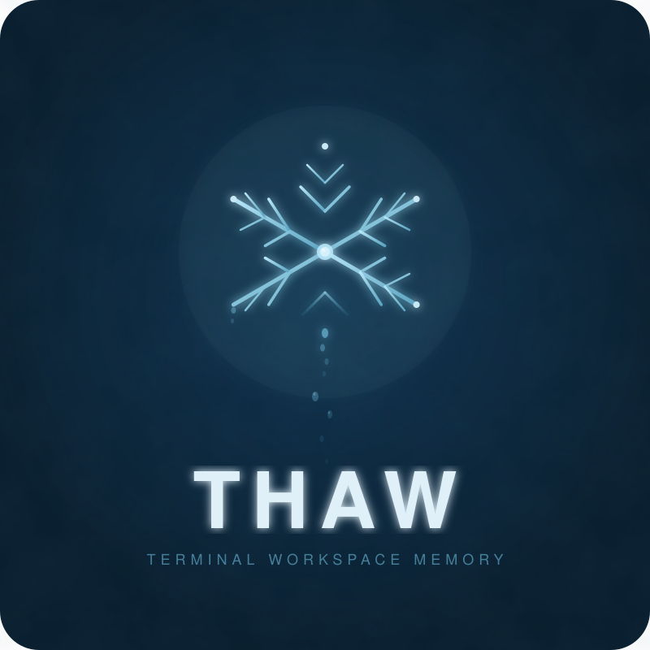

<p align="center">
  
</p>

<h1 align="center">thaw</h1>

<p align="center"><strong>Know what your work is worth. And never lose your workspace again.</strong></p>

<p align="center">
  
</p>

Thaw is a **work ledger** and a **workspace restorer**. It values every day of
your terminal work the way a hired team would bill it — then puts every
session, process, git branch, and env var back after a reboot, exactly as it was.

> Built by [JOECAT](https://github.com/joecattt) · Maintained by [Dreams Over Dollars Foundation](https://dreamsoverdollars.org) 501(c)(3)

**Trust model, up front:** everything stays on your machine (no cloud, no
accounts), credentials are scrubbed *before* they touch disk (best-effort,
pattern-based — see below), telemetry is off by default, and the daemon is
event-driven — it sleeps until macOS wakes it, so idle CPU cost rounds to
zero on the author's machine (not independently benchmarked). Details in
[Data & privacy](#data--privacy).

---

## Try it in 10 seconds — no daemon, no setup

`thaw recap` works on bare git history before you trust it with anything:

```
cd your-project && thaw recap yesterday

━━━ effort ━━━

  feat      9 commit(s) — 31.9–88.4h
  fix       8 commit(s) — 12.9–43.1h

  est. labor: 45.9–135.6h ($2,753–$23,736)
```

That's a rough estimate of what yesterday would have cost to hire. Every
commit is classified by type (feature/fix/refactor/security/…), given a
billable-hour range, scaled by real code churn, and priced at a default
$60–$175/hr — an assumed contractor-rate band, not market data thaw measures.
Every constant is tunable in `EffortConfig`. Run the daemon and the recap
grows a timeline: which projects, when, how long, what shipped.

## What it does

You're working across 12 terminal sessions. Two projects. Postgres running, dev server on port 3000, halfway through debugging a failing test. You close your laptop.

Tomorrow morning, you run `thaw`:

```
Last snapshot: 14h ago (Mon 5:12 PM)

  Projects to restore:
  1) Popupplaza [main*] — 8 sessions (6 active, 2 idle)
  2) api-project [feature/auth*] — 4 sessions ⚠ deps may be stale
     ↳ 3 new upstream commits — pull needed

  a) Restore all    q) Quit

  Choice:
```

Type `1`. Thaw rebuilds your tmux workspace — every pane, directory, env var, git branch — in seconds. Then `thaw run` starts your dev server and friends from `.thaw.toml` (once you've `thaw allow`ed the project, direnv-style).

## Install

```bash
# Homebrew (macOS/Linux)
brew install joecattt/tap/thaw
thaw setup

# From source
git clone https://github.com/joecattt/thaw.git && cd thaw
make install
thaw setup
```

`thaw setup` configures shell hooks, the background daemon, and runs a health check. One command.

## Commands

| Command | What it does |
|---------|-------------|
| `thaw` | Interactive restore picker |
| `thaw freeze` | Snapshot current state |
| `thaw save <name>` | Save named workspace |
| `thaw recall <name>` | Restore named workspace |
| `thaw recap` | Work summary + labor-cost valuation (text/voice/visual; works with zero setup) |
| `thaw progress` | Project health dashboard |
| `thaw context` | Last session state for a directory |
| `thaw export` | CSV/JSON data export |
| `thaw dashboard` | HTML analytics report |
| `thaw init` | Generate .thaw.toml for current project |
| `thaw diff` | Changes since last snapshot |
| `thaw status` | Active sessions |
| `thaw doctor` | Installation diagnostics |
| `thaw face` | Glanceable live stats — session length, commits, AI spend, CPU (experimental) |
| `thaw screensaver` | Auto-open the kiosk dashboard when the machine goes idle (experimental) |

`thaw dashboard --kiosk` is a full-screen giant-text rotating mode of the
dashboard — same data, built for glancing at from across a room.

Admin: `thaw admin note|forget|tag|audit|export|import|prune|migrate|uninstall`

## Project config

```toml
# .thaw.toml in any project root
[project]
name = "my-app"
restore_commands = ["npm run dev", "docker compose up -d"]
env = { NODE_ENV = "development" }
test_command = "npm test"
health_check = "curl -s localhost:3000/api/health"
```

Generate automatically: `thaw init`. Run the `restore_commands` with `thaw run` — but first
`thaw allow` the project once (direnv-style trust). Editing `.thaw.toml` revokes trust until you
re-allow it, so a cloned repo can never auto-run commands you haven't reviewed. `env` is applied
before the commands; `test_command`/`health_check`/`build_command` are metadata used by other views.

## Features

- **Claude Code resume** — panes that were running `claude` come back with `claude --resume <conversation-id>` pre-typed (Enter to thaw; auto-launched in `--run` mode). IDs are matched per-directory, newest first, so parallel panes each recover their own conversation. Works because Claude Code persists every conversation under `~/.claude/projects/` — a crash never loses one.
- **Melt animation** — restore plays a short ice-thaw animation (TTY only; disable with `THAW_NO_MELT=1`)
- **Interactive restore** — pick which projects to bring back
- **Trusted project commands** — `thaw run` starts your dev server from `.thaw.toml`, behind a `thaw allow` trust gate
- **Idle gap detection** — 30min+ gap triggers automatic context display
- **Autostash (opt-in)** — auto `git stash` when leaving a dirty repo; off by default (`thaw config set capture.autostash true`)
- **Upstream awareness** — new commits, CI failures, dep changes
- **Cross-session memory** — remembers per-directory across terminal restarts
- **Progress tracking** — git velocity, tests, TODOs, dependency health
- **Morning briefing** — cinematic HTML dashboard (opt-in: `thaw config set voice.morning_briefing true`)
- **Voice recap (optional)** — system/OSS TTS by default: macOS `say`, or `piper`/`espeak` on Linux if installed. No cloud. To narrate the briefing in any local voice you choose (including a self-hosted clone), see *Bring your own voice* below.
- **Export/analytics** — CSV/JSON for billing, time tracking, forensics
- **Credential scrubbing** — flags (`-p`, `--token`), `Bearer` tokens, `export SECRET=…`, JWTs, AWS/GitHub/GitLab/Slack keys, and PEM blocks are redacted *before* anything touches disk — on captured commands, history, env values, and output. Pattern-based and best-effort; see [Data & privacy](#data--privacy) for what it can miss
- **HMAC audit chain** — tamper detection on snapshot integrity

## Bring your own voice

The frost briefing's Voice button falls back to the browser's speech synthesis
unless you give it real audio. Point `voice.synth_cmd` at any command that
reads narration text on **stdin** and writes **WAV or MP3 bytes to stdout**:

```bash
thaw config set voice.synth_cmd '/path/to/your-tts-wrapper'
```

The command runs locally at briefing-generation time (16-minute ceiling) and
the audio is embedded into the page — nothing leaves your machine. A nonzero
exit or tiny output falls back to the browser voice, so a broken synthesizer
never blocks the briefing.

Examples:

```bash
# macOS say (instant)
#!/bin/sh
exec /usr/bin/say -v Samantha -o /dev/stdout --data-format=LEI16@22050 "$(cat)"

# piper (Linux, near-instant, natural)
#!/bin/sh
exec piper --model en_US-lessac-medium --output-file - < /dev/stdin
```

A cloned/neural voice (F5-TTS, XTTS, etc.) works the same way — but budget for
its render time on your hardware: minutes per phrase on CPU-only machines.
Cache by hashing the stdin text if your synthesizer is slow.

## Data & privacy

All data stays local in `~/.local/share/thaw/` (command log in `~/.local/state/thaw/`, mode 0600).
Every captured command, history line, environment-variable value, and captured output line is
scrubbed for credentials before it's written. **Scrubbing is best-effort and pattern-based**: it
recognizes known formats (AWS keys, GitHub/GitLab/Slack tokens, JWTs, PEM private-key blocks,
`Bearer`/`Basic` headers, `key=…`/`token=…`/`password …` patterns) — a secret in a format it
doesn't recognize, or shorter than the patterns' minimum lengths, can slip through. Clipboard and
browser-tab capture are opt-in (off by default). Snapshots are stored in plaintext — don't capture secrets you
wouldn't want on local disk. Run `thaw admin purge-secrets` to re-scrub an existing command log after
upgrading, `thaw config check` to find stale config keys, and `thaw admin uninstall` to remove everything.

Two more things worth knowing:

- **Network:** thaw itself makes no network requests — with one opt-in exception.
  `thaw dashboard --extras` (and the kiosk's extras mode) fetches news headlines
  at generation time from the free RSS feeds configured in `[news] sources`
  (default: Hacker News, BBC World, SCOTUSblog). Those servers see an ordinary
  HTTP fetch from your machine. Turn it off by never passing `--extras`, or
  empty the list: `thaw config set news.sources ""`.
- **Claude Code transcripts:** the dashboard and briefing read your local
  Claude Code conversation logs under `~/.claude/projects/` to build the
  resume cards (titles, durations, estimated cost). This is a local read only —
  nothing is sent anywhere — but the generated HTML report will contain those
  conversation titles.

## Telemetry

**Off by default.** Thaw sends nothing unless you explicitly opt in:

```bash
thaw config set telemetry.enabled true    # opt in
thaw config set telemetry.enabled false   # opt out (also deletes the anonymous ID)
```

If enabled, thaw sends anonymous usage events to a Firebase endpoint: a random device ID, thaw version, OS/arch, shell name, command *name* (never arguments, paths, or command content), and coarse counts (sessions, snapshots). Nothing is sent at all unless an endpoint is also configured (`telemetry.firebase_url` — empty by default in source builds).

## Requirements

macOS or Linux · tmux 3.0+ · Go 1.21+ (build) · zsh or bash

## Support

Thaw is free and open source, maintained by **Dreams Over Dollars Foundation**, a 501(c)(3).

**Contributions are tax-deductible:**
- [GitHub Sponsors](https://github.com/sponsors/joecattt)
- [Dreams Over Dollars](https://dreamsoverdollars.org/donate)

## License

MIT — [LICENSE](LICENSE)

Built by JOECAT · 2026 Joseph Anthony Reyna
